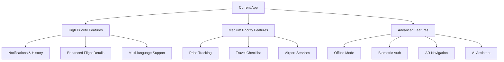

# Flight Information App - Feature Enhancement Analysis

Based on my analysis of the current Android flight information app, I've identified several potential features that could be added to enhance the user experience. The app currently includes flight search, travel suggestions, flight booking with seat selection, and weather information integration.

## Current App Structure Overview
- **Architecture**: MVVM with Hilt for dependency injection
- **Navigation**: Fragment-based with Jetpack Navigation
- **Data**: Retrofit for API communication, Gson for serialization
- **UI**: Material Design components with RecyclerView, SwipeRefreshLayout
- **Key Features**: Flight search, booking, seat selection, weather integration

## Feature Recommendations

### High Priority Features (Easy Implementation)

1. **Flight Status Notifications**
   - Push notifications for flight delays, cancellations, gate changes
   - Real-time updates when flight status changes
   - Requires Firebase Cloud Messaging integration
   - Leverages existing FlightInfo data model
   - Users can customize notification preferences

2. **Flight History Tracking**
   - Save previously searched flights
   - Local database storage using Room
   - Quick access to frequent searches

3. **Enhanced Flight Details View**
   - Aircraft information display
   - Flight path visualization on map
   - Airport terminal maps integration

4. **Multi-language Support**
   - Chinese/English language toggle
   - String resource localization
   - RTL layout support

### Medium Priority Features (Moderate Implementation)

1. **Flight Price Tracking**
   - Price history graphs
   - Price drop alerts
   - Integration with existing FlightSearch functionality

2. **Travel Checklist**
   - Customizable packing lists
   - Location-based reminders
   - Integration with travel dates

3. **Airport Services Integration**
   - Restaurant/retail information
   - Lounge access details
   - Parking/shuttle information

4. **Social Sharing**
   - Share flight details with friends
   - Travel experience sharing
   - Integration with social media platforms

### Advanced Features (Complex Implementation)

1. **Offline Mode**
   - Cached flight data
   - Offline booking capabilities
   - Sync when connection restored

2. **Biometric Authentication**
   - Fingerprint/Face ID for booking security
   - Secure storage of passenger information
   - Integration with Android Keystore

3. **AR Airport Navigation**
   - Augmented reality wayfinding
   - Indoor positioning system
   - Integration with device sensors

4. **AI-Powered Travel Assistant**
   - Chatbot for travel queries
   - Personalized recommendations
   - Voice command support

## Detailed Implementation Plan for Flight Status Notifications

Since the user specifically requested flight status change notifications, here's a detailed implementation plan for this feature:

### Technical Requirements
1. **Firebase Integration**
   - Add Firebase Cloud Messaging (FCM) dependency
   - Configure Firebase project in the app
   - Implement FCM service for receiving notifications

2. **Backend Service**
   - Create a service to monitor flight status changes
   - Integrate with existing flight API
   - Implement notification triggering logic

3. **Local Storage**
   - Store user's tracked flights in Room database
   - Save notification preferences
   - Cache recent flight status for quick access

4. **UI Components**
   - Notification settings screen
   - Flight tracking toggle in flight details
   - Notification history view

### Implementation Steps

1. **Setup Firebase**
   - Add firebase-bom to Gradle dependencies
   - Add google-services.json to app
   - Initialize Firebase in Application class

2. **Create Notification Service**
   - Extend FirebaseMessagingService
   - Handle token refresh
   - Process incoming messages

3. **Implement Flight Tracking**
   - Add "Track Flight" button in flight details
   - Store tracked flights in database
   - Create background service to check status

4. **Notification Display**
   - Create notification channels for Android 8+
   - Design notification templates
   - Handle notification taps

5. **User Preferences**
   - Add notification settings screen
   - Allow users to customize notification types
   - Implement do-not-disturb options

### Data Models Needed
```kotlin
data class TrackedFlight(
    val flightId: String,
    val flightNumber: String,
    val lastStatus: String,
    val lastUpdated: Long,
    val notificationEnabled: Boolean
)

data class NotificationSettings(
    val delayNotifications: Boolean = true,
    val cancellationNotifications: Boolean = true,
    val gateChangeNotifications: Boolean = true,
    val doNotDisturbStart: String = "22:00",
    val doNotDisturbEnd: String = "07:00"
)
```

## Implementation Roadmap



## Technical Considerations

1. **Permissions**: Some features will require additional permissions (location, biometrics)
2. **API Integration**: Advanced features may require third-party service integration
3. **Storage**: Consider Room database for offline capabilities and history tracking
4. **Security**: Implement proper encryption for sensitive user data

The app has a solid foundation with MVVM architecture and dependency injection, making it well-suited for these enhancements. The existing data models and network infrastructure can be extended to support most of these features.