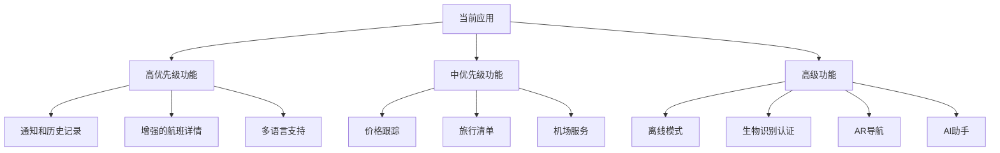

# 航班信息应用 - 功能增强分析

根据我对当前Android航班信息应用的分析，我确定了几个可以添加的功能来增强用户体验。该应用目前包括航班搜索、旅行建议、带座位选择的航班预订以及天气信息集成。

## 当前应用结构概述
- **架构**: MVVM架构，使用Hilt进行依赖注入
- **导航**: 基于Fragment的Jetpack导航
- **数据**: Retrofit用于API通信，Gson用于序列化
- **UI**: 使用RecyclerView、SwipeRefreshLayout的Material Design组件
- **主要功能**: 航班搜索、预订、座位选择、天气集成

## 功能建议

### 高优先级功能（易于实现）

1. **航班状态通知**
   - 航班延误、取消、登机口变更的推送通知
   - 航班状态变化时的实时更新
   - 需要Firebase Cloud Messaging集成
   - 利用现有的FlightInfo数据模型
   - 用户可以自定义通知偏好

2. **航班历史记录跟踪**
   - 保存以前搜索的航班
   - 使用Room进行本地数据库存储
   - 快速访问频繁搜索

3. **增强的航班详情视图**
   - 飞机信息显示
   - 地图上的航班路径可视化
   - 机场航站楼地图集成

4. **多语言支持**
   - 中文/英文语言切换
   - 字符串资源本地化
   - RTL布局支持

### 中优先级功能（中等实现难度）

1. **航班价格跟踪**
   - 价格历史图表
   - 价格下降提醒
   - 与现有FlightSearch功能集成

2. **旅行清单**
   - 可自定义的打包清单
   - 基于位置的提醒
   - 与旅行日期集成

3. **机场服务集成**
   - 餐厅/零售信息
   - 休息室访问详情
   - 停车/班车信息

4. **社交分享**
   - 与朋友分享航班详情
   - 旅行体验分享
   - 与社交媒体平台集成

### 高级功能（复杂实现）

1. **离线模式**
   - 缓存的航班数据
   - 离线预订功能
   - 连接恢复时同步

2. **生物识别认证**
   - 指纹/面部识别用于预订安全
   - 乘客信息的安全存储
   - 与Android密钥库集成

3. **AR机场导航**
   - 增强现实路径导航
   - 室内定位系统
   - 与设备传感器集成

4. **AI驱动的旅行助手**
   - 旅行查询聊天机器人
   - 个性化推荐
   - 语音命令支持

## 航班状态通知的详细实现计划

由于用户特别要求航班状态变更通知，以下是该功能的详细实现计划：

### 技术要求
1. **Firebase集成**
   - 添加Firebase Cloud Messaging (FCM)依赖
   - 在应用中配置Firebase项目
   - 实现FCM服务以接收通知

2. **后端服务**
   - 创建服务以监控航班状态变化
   - 与现有航班API集成
   - 实现通知触发逻辑

3. **本地存储**
   - 在Room数据库中存储用户跟踪的航班
   - 保存通知偏好设置
   - 缓存最近的航班状态以快速访问

4. **UI组件**
   - 通知设置屏幕
   - 航班详情中的航班跟踪切换
   - 通知历史视图

### 实现步骤

1. **设置Firebase**
   - 在Gradle依赖中添加firebase-bom
   - 将google-services.json添加到应用
   - 在Application类中初始化Firebase

2. **创建通知服务**
   - 扩展FirebaseMessagingService
   - 处理令牌刷新
   - 处理传入消息

3. **实现航班跟踪**
   - 在航班详情中添加"跟踪航班"按钮
   - 在数据库中存储跟踪的航班
   - 创建后台服务以检查状态

4. **通知显示**
   - 为Android 8+创建通知渠道
   - 设计通知模板
   - 处理通知点击

5. **用户偏好设置**
   - 添加通知设置屏幕
   - 允许用户自定义通知类型
   - 实现免打扰选项

### 所需数据模型
```kotlin
data class TrackedFlight(
    val flightId: String,
    val flightNumber: String,
    val lastStatus: String,
    val lastUpdated: Long,
    val notificationEnabled: Boolean
)

data class NotificationSettings(
    val delayNotifications: Boolean = true,
    val cancellationNotifications: Boolean = true,
    val gateChangeNotifications: Boolean = true,
    val doNotDisturbStart: String = "22:00",
    val doNotDisturbEnd: String = "07:00"
)
```

## 实现路线图



## 技术考虑

1. **权限**: 某些功能需要额外的权限（位置、生物识别）
2. **API集成**: 高级功能可能需要第三方服务集成
3. **存储**: 考虑使用Room数据库进行离线功能和历史记录跟踪
4. **安全**: 为敏感用户数据实现适当的加密

该应用具有MVVM架构和依赖注入的坚实基础，非常适合这些增强功能。现有的数据模型和网络基础设施可以扩展以支持大多数这些功能。